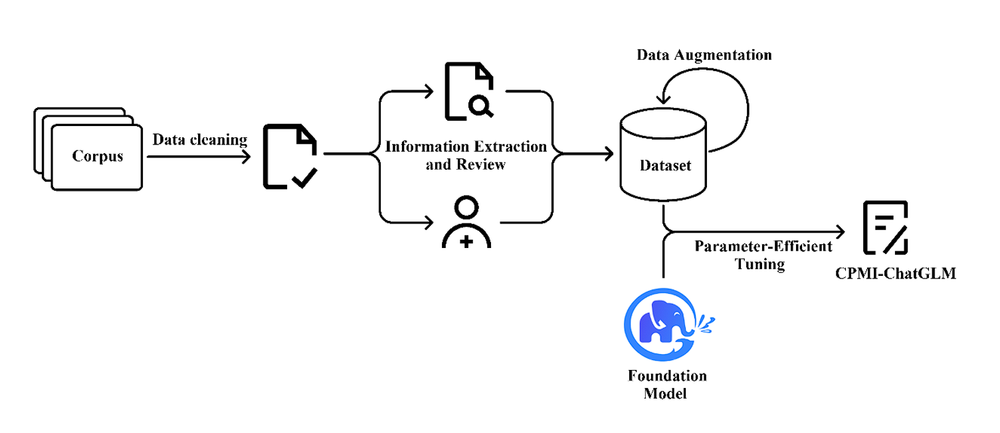

# CPMI-ChatGLM

This is the official repository of [**CPMI-ChatGLM: parameter-efficient fine-tuning ChatGLM with Chinese patent medicine instructions**](https://www.nature.com/articles/s41598-024-56874-w), which contains the dataset of Chinese patent medicine instructions(CPMI) used to train CPMI-ChatGLM.

<p align="center" width="100%">
<a href="https://github.com/liucann/test_cpmi/" target="_blank"></a>
</p>

## Introduction

Chinese patent medicine (CPM) is a typical type of traditional Chinese medicine (TCM) preparation that uses Chinese herbs as raw materials and is an important means of treating diseases in TCM. 

Chinese patent medicine instructions (CPMI) serve as a guide for patients to use drugs safely and effectively. 

In this study, we apply a pre-trained language model (PLM) to the domain of CPM. We have meticulously assembled, processed, and released the first CPMI dataset and fine-tuned the foundation model ChatGLM-6B, resulting in the development of CPMI-ChatGLM. We evaluated the performance of CPMI-ChatGLM using BLEU, ROUGE, BARTScore, and the human evaluation method (SUS). 

CPMI-ChatGLM demonstrated commendable proficiency in providing recommendations for CPM, making it a promising tool for assisting in the diagnosis and treatment process.  


## Dataset construction

Our original dataset primarily derives from three channels:

1) *Standard Therapeutic Guidelines for National Essential Drugs (Chinese Patent Medicine)* (ISBN 9787117286916). The guideline provides comprehensive and systematic information on 268 CPMs across 7 specialized fields, including internal medicine, surgery, gynecology, ophthalmology, otolaryngology, orthopedics, and pediatrics.  

2) To enhance the model's capacity to learn various disease types, we expanded our dataset by merging it with [*Entity Recognition of Traditional Chinese Medicine's Manual*](https://tianchi.aliyun.com/dataset/86819) from Aliyun Tianchi. The Tianchi dataset comprises 1997 records sourced from instructions for TCM. It encompasses 13 key categories, including drugs, drug components, syndromes, properties, flavors, and Chinese medicinal effects.

3) Additionally, we collected a set of 100 patient consultation records and corresponding CPM prescriptions from our affiliated TCM hospital outpatient department. After removing personal information, these additional data were merged into the corpus.

The following is a case of instruction data from the CPMI dataset. The dataset consists of a total of **3906** cases.

```
{
    "instruction": "使用中医知识正确回答适合这个病例的中成药。",
    "input": "我前几天吃了很多食物，但肚子总是不舒服，咕咕响，还经常嗳气反酸，大便不成形，脸色也差极了。",
    "output": "香砂六君丸可能适合治疗您的病症。以下是香砂六君丸的详细说明书：【主要成分】木香、砂仁、党参、炒白术、茯苓、炙甘草、陈皮、姜半夏、生姜、大枣。【性状】本品为棕色的浓缩丸；气微香、辛或气微香，味微甜、辛。【规格】300丸。【功能主治】益气健脾，和胃。用于脾虚气滞，消化不良，嗳气食少，脘腹胀满，大便溏泄。【用法用量】口服，一次12丸，一日3次。【不良反应】尚不明确。【生产企业】仲景宛西制药股份有限公司。【注意事项】1、忌食生冷油腻不易消化食物。 2、不适用于口干、舌少津、大便干者。 3、不适用于急性胃肠炎、主要表现为恶心、呕吐、大便水泻频频，脘腹作痛。 4、小儿用法用量，请咨询医师或药师。 5、服药三天症状无改善，或出现其他症状时，应立即停用并到医院诊治。 6、对本品过敏者禁用，过敏体质者慎用。 7、本品性状发生改变时禁止使用。 8、儿童必须在成人监护下使用。 9、请将本品放在儿童不能接触的地方。 10、如正在使用其他药品，使用本品前请咨询医师或药师。11、孕妇忌服。"
}
...
```


## Disclaimer

The resources related to this project are intended solely for academic research purposes and are strictly prohibited for commercial use. Some of the datasets used in this project are generated through LLMs augmentation. Although they may adhere to certain medical facts, they should not be used as a basis for actual medical diagnosis. This project does not assume any legal responsibility for the content generated by the model, nor is it liable for any losses that may arise from the use of the provided resources and the resulting output.

## Citation

If you have utilized the data from this project, please declare the reference:

```
@article{liu2024cpmi,
  title={CPMI-ChatGLM: parameter-efficient fine-tuning ChatGLM with Chinese patent medicine instructions},
  author={Liu, Can and Sun, Kaijie and Zhou, Qingqing and Duan, Yuchen and Shu, Jianhua and Kan, Hongxing and Gu, Zongyun and Hu, Jili},
  journal={Scientific Reports},
  volume={14},
  number={1},
  pages={6403},
  year={2024},
  publisher={Springer Nature},
  doi={10.1038/s41598-024-56874-w}
}
```

## Acknowledgement

Thank you to my master's supervisor, [Jili Hu](https://github.com/hujili007), and the support of the foundation model [ChatGLM-6B](https://github.com/THUDM/ChatGLM-6B).